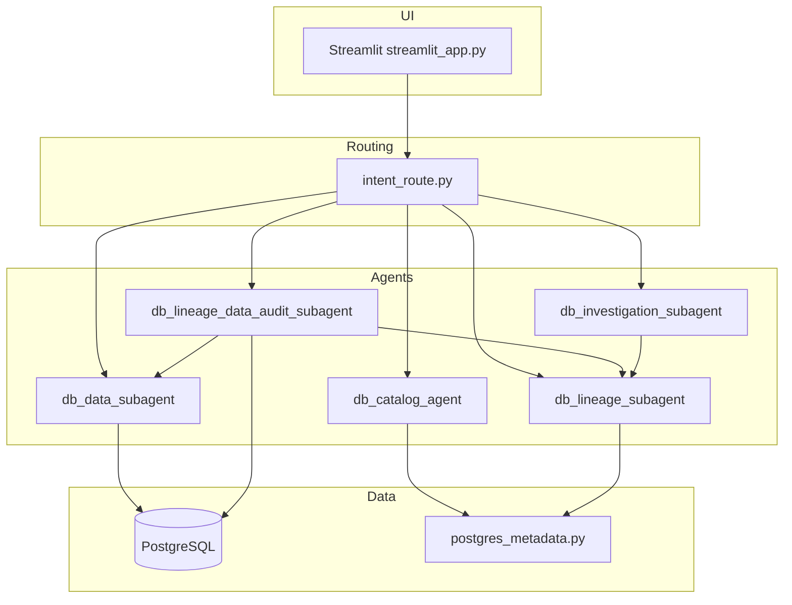

# Giga4DQM

**Giga4DQM** is a **PostgreSQL** assistant for metadata exploration, read-only analytics, DDL-based lineage, pipeline-style data audits, and investigation workflows (suggested diagnostic SQL). Natural language is handled by **[GigaChat](https://developers.sber.ru/portal/products/gigachat)**; answers are often **structured JSON** (Pydantic parsers) on top of prose. Optional **[Langfuse](https://langfuse.com)** tracing records agent runs and model calls.

You can use the **Streamlit UI** or run the same **CLI agents** the UI spawns as subprocesses.

---

## What it does

| Capability | Description |
|------------|-------------|
| **Catalog** | Questions about tables, views, columns, routines, and DDL loaded from `pg_catalog` / `information_schema` via shared metadata helpers. |
| **Data** | One **read-only** `SELECT` (or `WITH … SELECT`) per question using LangChain `SQLDatabase`; result summarized in natural language. |
| **Lineage** | Upstream/downstream relationships inferred from **view and routine definitions** (`pg_get_viewdef`, `pg_get_functiondef`)—not from sampling row data. Uses **GigaChat-Pro** by default (`LINEAGE_MODEL`). |
| **Audit** | Lineage first, then a **data** pass scoped to upstream sources relevant to marts/pipelines. |
| **Investigate** | Lineage plus a **bundle of suggested diagnostic SELECTs** (you run them); tuned for pasted SQL and suspected bad values, with optional single-column focus. |

**Auto** mode calls a small **intent router** (`intent_route.py`): heuristics first, then a short GigaChat JSON classification when needed.

---

## Architecture (high level)



- **Metadata** paths use **psycopg** and [`ai-agent-tools/scripts/postgres_metadata.py`](ai-agent-tools/scripts/postgres_metadata.py).
- **Data** paths use **SQLAlchemy** + **psycopg** (`postgresql+psycopg://`) with validation that only read-only SQL runs.

More diagrams and narrative: **[`workflow.md`](workflow.md)**.

---

## Requirements

- **Python 3.12+**
- **[uv](https://docs.astral.sh/uv/)** (recommended)
- **PostgreSQL** reachable from your environment
- **GigaChat** credentials (`GIGACHAT_API_KEY` or `GIGACHAT_EMBEDDINGS_CREDENTIALS`)

---

## Installation

```bash
git clone https://github.com/Xpehutta/giga4dqm.git
cd giga4dqm
cp .env.example .env
# Edit .env — see [Configuration](#configuration) below.

uv sync
```

Dependencies are declared in [`pyproject.toml`](pyproject.toml) under `[dependency-groups].dev` (GigaChat, LangChain, LangGraph, Streamlit, psycopg, Langfuse, etc.).

---

## Configuration

Copy **`.env.example`** → **`.env`**. The real **`.env`** is gitignored—do not commit secrets.

### PostgreSQL

| Variables | Purpose |
|-----------|---------|
| `PGHOST`, `PGPORT`, `PGDATABASE`, `PGUSER`, `PGPASSWORD` | Standard connection params. |
| `PG_DSN` | Alternative single DSN (see [`ai-agent-tools/README.md`](ai-agent-tools/README.md) for SQLAlchemy URI style for the data subagent). |

### GigaChat

| Variables | Purpose |
|-----------|---------|
| `GIGACHAT_API_KEY` or `GIGACHAT_EMBEDDINGS_CREDENTIALS` | Required for all LLM-backed agents. |
| `GIGACHAT_API_URL`, `GIGACHAT_VERIFY_SSL`, `GIGACHAT_SCOPE` | Optional; defaults match typical Sber GigaChat setups. |
| `MODEL` | Default chat model (e.g. `GigaChat-Pro`) for catalog, data, and intent routing. |
| `LINEAGE_MODEL` | Overrides model only for lineage-heavy agents (default `GigaChat-Pro`). |
| `GIGACHAT_TIMEOUT` | Request timeout (seconds). |
| `GIGACHAT_CONNECT_TIMEOUT` | Optional TLS/connect budget if OAuth/API handshake is slow on VPN. |
| `GIGACHAT_INTENT_TIMEOUT` | Optional override for **`intent_route`** only (else `GIGACHAT_TIMEOUT` or 60s). |

### Logging

| Variable | Purpose |
|----------|---------|
| `LOG_LEVEL` | e.g. `INFO`, `DEBUG` — stderr logging for Streamlit and agents (`giga4dqm.*` loggers). |

### Langfuse (optional)

Set **`LANGFUSE_PUBLIC_KEY`** and **`LANGFUSE_SECRET_KEY`** for tracing (e.g. [Langfuse Cloud](https://cloud.langfuse.com) or your self-hosted URL via **`LANGFUSE_BASE_URL`**). Agent runs create **agent** observations; each GigaChat call is a **generation**. Use **`LANGFUSE_TRACING_ENABLED=false`** to disable exports.

Full detail (EU project notes, observation names, sample rate): **[`ai-agent-tools/README.md`](ai-agent-tools/README.md)** § Environment.

---

## Optional: Postgres in Docker

```bash
docker compose up -d
```

[`docker-compose.yml`](docker-compose.yml) exposes PostgreSQL on **localhost:5433** with database/user/password **`giga4dqm`**. Point your `.env` `PGPORT` and credentials at this instance when using the bundled stack.

---

## Run the Streamlit app

From the **repository root**:

```bash
uv run streamlit run streamlit_app.py
```

### Sidebar: schema

- All agents use **one PostgreSQL schema** per turn (dropdown + optional **Override**).
- Valid names are unquoted identifiers: letters, digits, underscore.
- Non-`public` schemas are preferred in the list when present; confirm the target schema for your database.

### Sidebar: agent mode

| Mode | When to use |
|------|-------------|
| **Auto** | Mixed questions; router chooses catalog, data, lineage, **both**, **audit**, or **investigate**. |
| **Catalog** | Table/column/routine metadata and DDL context only. |
| **Data** | Straightforward aggregates, counts, filters—one executed SELECT + explanation. |
| **Lineage** | Where a column or view gets its definition in **DDL** (upstream/downstream objects). |
| **Audit** | Lineage plus **one** interactive data check over upstream sources. |
| **Investigate** | Suspicious values, often with **pasted SQL**; get lineage plus **many suggested** read-only SELECTs (not auto-executed). |

If **Auto** misclassifies, pin the mode manually.

### Budgets (when shown)

- **Max DDL context chars** — lineage-related modes; raise if large view definitions are truncated; lower for cost/latency.
- **Max table-info chars** — **Data** / **Audit** (and Auto when routed there); caps LangChain table info passed to the model.

### Chat behavior

- Prior turns are included as **conversation context** (size-capped); the latest user line is marked **Current** in the payload sent to agents.
- Use **Clear conversation** when switching topics so routing and prompts are not polluted.

Deep dive: **[`workflow.md`](workflow.md)** (routing examples, FAQ-style question templates, JSON expanders).

---

## CLI agents

All examples assume you run from the **repo root** with `uv run` and a populated `.env`.

| Script | Role |
|--------|------|
| [`ai-agent-tools/agents/db_catalog_agent.py`](ai-agent-tools/agents/db_catalog_agent.py) | Catalog Q&A (LangGraph + in-process metadata). |
| [`ai-agent-tools/agents/db_data_subagent.py`](ai-agent-tools/agents/db_data_subagent.py) | Read-only SQL + explanation. |
| [`ai-agent-tools/agents/db_lineage_subagent.py`](ai-agent-tools/agents/db_lineage_subagent.py) | DDL lineage. |
| [`ai-agent-tools/agents/db_lineage_data_audit_subagent.py`](ai-agent-tools/agents/db_lineage_data_audit_subagent.py) | Lineage then data audit. |
| [`ai-agent-tools/agents/db_investigation_subagent.py`](ai-agent-tools/agents/db_investigation_subagent.py) | Lineage then diagnostic SQL bundle. |
| [`ai-agent-tools/agents/sql_definition_extract_subagent.py`](ai-agent-tools/agents/sql_definition_extract_subagent.py) | Extract base SQL from docs/defs (no LLM). |

**Examples:**

```bash
# Catalog (replace schema with yours)
uv run python ai-agent-tools/agents/db_catalog_agent.py \
  --schema public \
  --question "Which tables hold loan facts and their keys?" \
  --pretty

# Data
uv run python ai-agent-tools/agents/db_data_subagent.py \
  --schema public \
  --question "How many rows per loan status?" \
  --pretty

# Lineage
uv run python ai-agent-tools/agents/db_lineage_subagent.py \
  --schema public \
  --question "Where does mart_column X in view V come from?" \
  --pretty
```

**Export catalog JSON** (no LLM):

```bash
uv run python ai-agent-tools/scripts/export_db_catalog.py \
  --schema public \
  --pretty --output ai-agent-tools/configs/db_catalog.json
```

More flags and notebooks: **[`ai-agent-tools/README.md`](ai-agent-tools/README.md)**.

---

## Demo schema (loans / banking)

Guided setup and semantics: **[`setup_loan_db.md`](setup_loan_db.md)**.  
SQL bundles: [`sql/setup_loans/`](sql/setup_loans/) (idempotent steps, optional Python driver [`sql/setup_loans/run_apply.py`](sql/setup_loans/run_apply.py)).

---

## Langfuse (self-hosted)

[`docker-compose.langfuse.yml`](docker-compose.langfuse.yml) runs a full Langfuse v3 stack. Use a **dedicated Compose project name** so its Postgres service does not replace the app database—for example:

```bash
docker compose -p langfuse-giga4dqm -f docker-compose.langfuse.yml up -d
```

Read the **file header** for ports and the `-p` requirement.

---

## Repository layout

| Path | Purpose |
|------|---------|
| [`streamlit_app.py`](streamlit_app.py) | Chat UI, subprocess orchestration, intent import. |
| [`ai-agent-tools/`](ai-agent-tools/) | Agents, prompts, `tools.md`, `skills.md`, scripts, sample configs. |
| [`sql/setup_loans/`](sql/setup_loans/) | Loan/banking demo DDL and data. |
| [`Script_DB/`](Script_DB/), [`Script_DB_pg/`](Script_DB_pg/) | Legacy / alternate SQL and test scripts. |
| [`notebooks/`](notebooks/) | Jupyter checks for agents and Postgres. |
| [`src/giga4dqm/`](src/giga4dqm/) | Small package; tests in [`tests/`](tests/). |
| [`docker-compose.yml`](docker-compose.yml) | Dev PostgreSQL. |
| [`docker-compose.langfuse.yml`](docker-compose.langfuse.yml) | Optional Langfuse stack. |
| [`workflow.md`](workflow.md) | End-user workflow, routing tables, diagrams. |

---

## Development

```bash
uv run pytest
uv run ruff check .
```

---

## Documentation index

| Document | Contents |
|----------|----------|
| **This file** | Onboarding, config summary, UI and CLI entry points. |
| [`workflow.md`](workflow.md) | Streamlit workflow, auto-routing examples, architecture, question templates. |
| [`ai-agent-tools/README.md`](ai-agent-tools/README.md) | Environment variables, every agent CLI, Langfuse details, logging. |
| [`setup_loan_db.md`](setup_loan_db.md) | Demo database walkthrough. |

---

## License

Add a `LICENSE` file or set the license in GitHub repository settings if you want explicit open-source terms.
