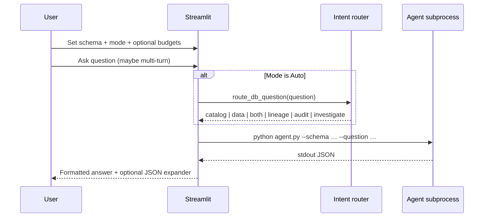
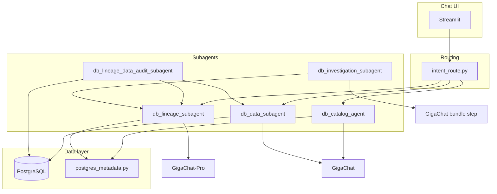
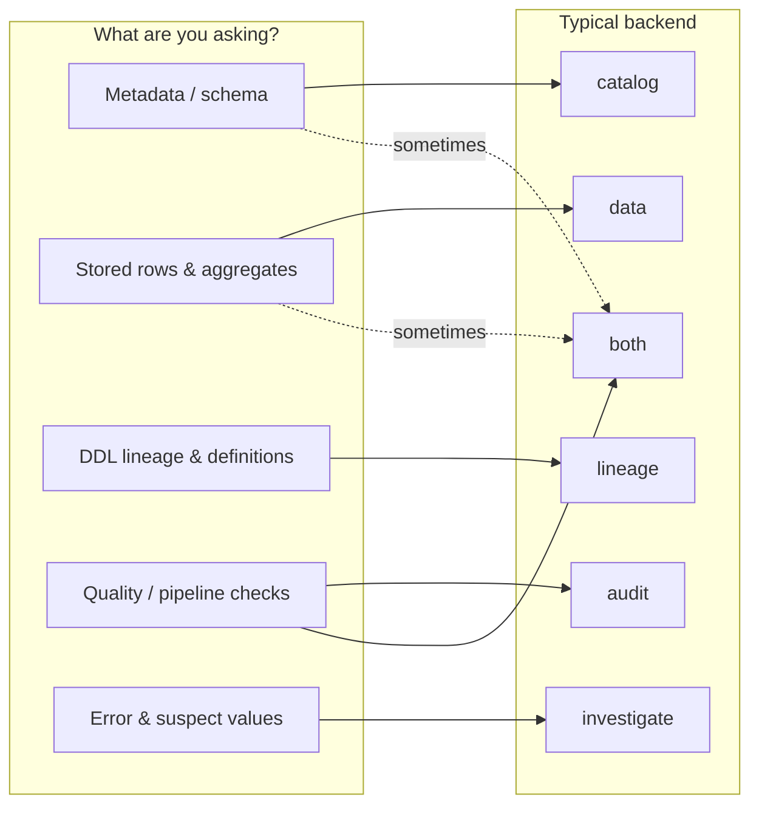
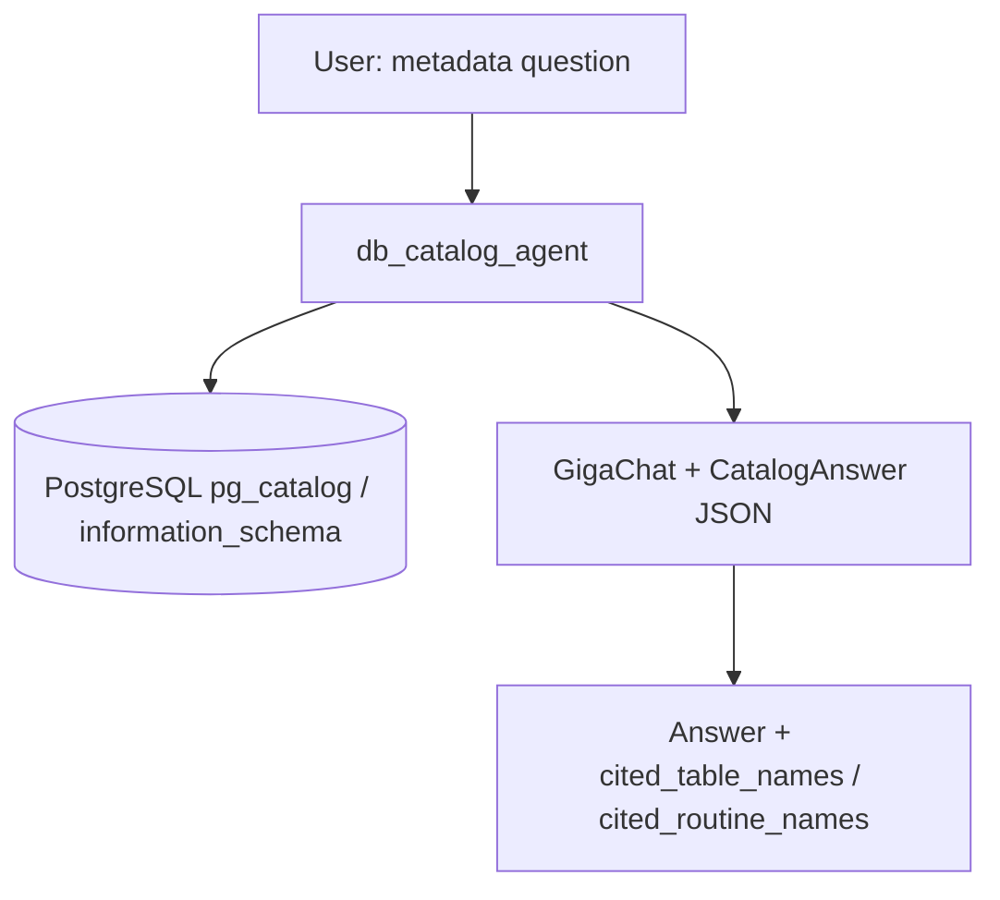
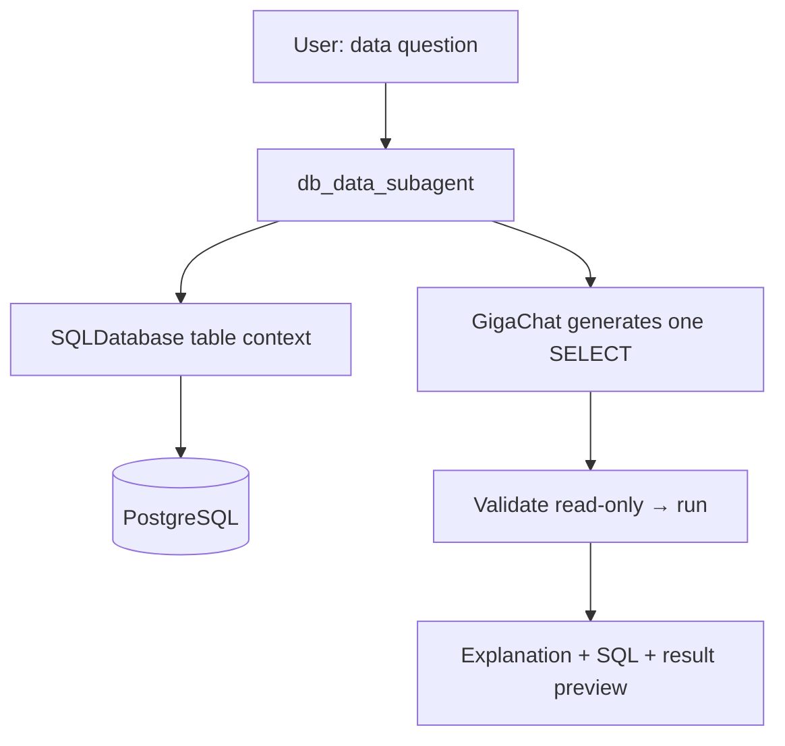
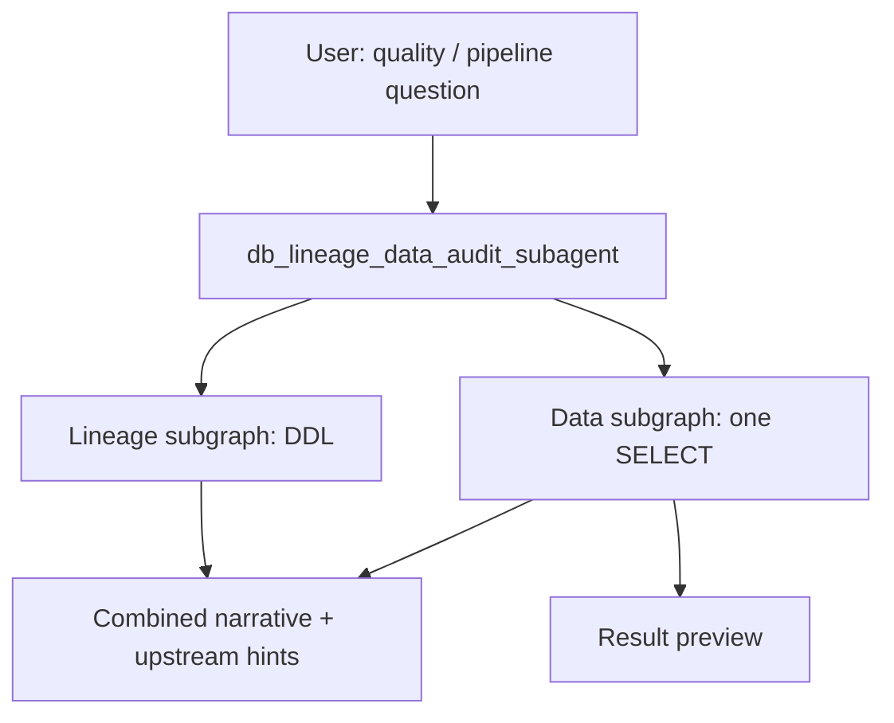
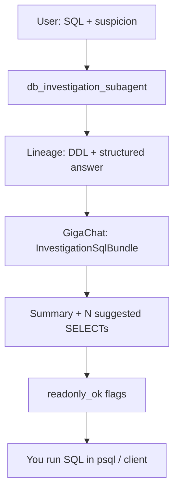
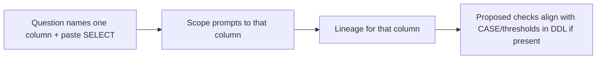

# Giga4DQM workflow

This document describes how the database assistant stack fits together, how to use it day to day, concrete examples, and what each path does.

---

## What this system is

Giga4DQM is a **PostgreSQL-focused assistant** that combines:

- **In-database metadata** (tables, views, routines, DDL from `pg_catalog` / `information_schema`)
- **GigaChat** for natural-language answers and structured JSON (via Pydantic parsers)
- **LangGraph** for multi-step agent flows (catalog, lineage, audit, investigation)

You can drive it from the **Streamlit app** (`streamlit_app.py`) or by running the **CLI entrypoints** under `ai-agent-tools/agents/`. The UI usually spawns the same scripts as subprocesses; settings and schema are passed as arguments.

---

## User workflow (Streamlit)

Use this sequence when you open the app for the first time or switch databases.

### 1. Configure environment

From the repository root, ensure `.env` contains PostgreSQL credentials (`PG*` or `PG_DSN`) and GigaChat (`GIGACHAT_API_KEY` or `GIGACHAT_EMBEDDINGS_CREDENTIALS`). Details are in `ai-agent-tools/README.md`.

### 2. Start the UI

```bash
uv run streamlit run streamlit_app.py
```

### 3. Pick schema

All agents run against **one schema namespace** per chat turn (sidebar):

- Use **Override** if discovery lists the wrong default or you know the exact name (e.g. `loans`).
- Non-`public` schemas appear first in the dropdown when multiple exist; `public` is not silently assumed—confirm or override when needed.

Invalid schema strings are rejected (unquoted identifiers: letters, digits, underscore).

### 4. Choose agent mode

| Your goal | Suggested mode |
|-----------|------------------|
| Let the system decide each turn | **Auto** |
| Explore tables, columns, routines only | **Catalog** |
| One analytical query + answer | **Data** |
| Where data flows in DDL (views/functions) | **Lineage** |
| Lineage plus **one** executed SELECT on source data | **Audit** |
| Lineage plus **many suggested** SELECTs you run yourself | **Investigate** |

### 5. Tune budgets (when visible)

- **Max DDL context chars** — Applies to lineage-heavy modes (**Auto**, **Lineage**, **Audit**, **Investigate**). Raise if your schema has many large views and answers feel truncated; lower if responses are slow or tokens are costly.
- **Max table-info chars** — Applies when **Data** or **Audit** (or **Auto** routing to those) builds LangChain table context.

### 6. Chat

Type questions in the chat box. Earlier turns are attached as **conversation context** (bounded size); the latest message is labeled **Current** inside the composed prompt—agents are instructed to answer that line using prior context when helpful.

### 7. Inspect results

- Markdown answers appear inline.
- Use **Raw JSON / details** expanders when present to inspect structured payloads (catalog citations, lineage `structured`, investigation query bundles).

### 8. Reset when switching topics

**Clear conversation** removes prior turns so routing and prompts do not carry stale context.

---

### User journey (diagram)



---

## High-level architecture



- **Metadata** (catalog, lineage DDL) is read through **psycopg** and shared helpers in `ai-agent-tools/scripts/postgres_metadata.py`.
- **Row-level questions** use **LangChain `SQLDatabase`** (SQLAlchemy + read-only `SELECT`).
- **Lineage** does **not** query live row data by default; it infers upstream/downstream from **view and routine definitions** (`pg_get_viewdef`, `pg_get_functiondef`).

---

## Modes (reference)

| Mode | What runs | Best for |
|------|------------|----------|
| **Auto** | `intent_route.route_db_question` then one backend | Mixed questions; routing picks catalog, data, lineage, both, audit, or investigate |
| **Catalog** | `db_catalog_agent` | Schema design, columns, types, routines, “what exists” |
| **Data** | `db_data_subagent` | Counts, samples, aggregates, one **read-only** SQL + explanation |
| **Lineage** | `db_lineage_subagent` | Upstream/downstream for a table/column from **DDL**; optional verbatim **defining_expressions** (e.g. full `CASE … AS col`) when present in deployed view text |
| **Audit** | `db_lineage_data_audit_subagent` | Lineage first, then **one** interactive data pass on sources (SQL + preview) |
| **Investigate** | `db_investigation_subagent` | Lineage + **bundle of suggested diagnostic SELECTs** (not auto-executed); pasted SQL + suspicion; optional single-column focus |

---

## Auto routing: how questions map (examples)

Routing blends **heuristics** (fast keyword checks) and a **short GigaChat JSON call**. Approximate behavior:

| Example question shape | Typical route |
|------------------------|----------------|
| “List tables and column types for …” | **catalog** |
| “How many rows in `customer_credit_risk`?” | **data** |
| “What columns define `risk_category` and upstream tables?” | **lineage** |
| “Why might this mart disagree with staging—check nulls upstream.” | **audit** or **both** |
| “Possible **error** in **value risk_category** using `SELECT … FROM …` — **help me check**” | **investigate** (heuristic: SQL + suspicion phrases) |
| “Is this value correct?” without mentioning definitions | often **both** (catalog + one data path) |

When **Auto** disagrees with your intent, pin **Catalog**, **Data**, **Lineage**, **Audit**, or **Investigate** in the sidebar.

---

## Example user questions (by intent)

Use these patterns as templates. Replace object names with your tables, views, and columns.

### Overview: question type → backend



---

### Metadata (schema, definitions, “what exists”)

**Pinned mode:** **Catalog** (or **Auto**).

| Example user question | What the agent uses |
|----------------------|---------------------|
| “What tables and views exist in this schema?” | Full catalog snapshot |
| “List columns of `customers` with data types and nullability.” | Table metadata |
| “Are there CHECK constraints or indexes on `loans.loan_id`?” | Constraints / indexes from catalog tools |
| “Which procedures read from `payments`?” | Routine metadata |
| “Does view `customer_credit_risk` exist and what objects does its DDL mention?” | Views + DDL references |



---

### Data (counts, samples, aggregates on real rows)

**Pinned mode:** **Data** (or **Auto**).

| Example user question | Notes |
|----------------------|--------|
| “How many distinct `customer_id` values appear in `customer_credit_risk`?” | Single analytical SELECT |
| “Top 5 loans by `loan_amount`.” | Model generates read-only SQL + runs it |
| “Show me 10 random rows from `delinquencies`.” | Preview in response |
| “Average `credit_score` by city if the column exists.” | Depends on context from `SQLDatabase` |



---

### Lineage & definitions (DDL only, no row audit)

**Pinned mode:** **Lineage** (or **Auto**).

| Example user question | Notes |
|----------------------|--------|
| “Where does `risk_category` in `customer_credit_risk` come from?” | Upstream objects from view/function DDL |
| “What views depend on base table `customers`?” | Downstream |
| “Paste the logic that derives `risk_category` if it appears in view DDL.” | May appear under **Definition from DDL** if DB has full view body |
| “Map upstream from `payment_behaviour` to source tables.” | Ranked DDL blob + GigaChat-Pro |

---

### Quality, pipelines, and “is the mart trustworthy?”

**Pinned mode:** **Audit** or **Auto** (may route to **both**).

| Example user question | Notes |
|----------------------|--------|
| “Trace `customer_credit_risk` and check for NULLs on join keys in upstream sources.” | Lineage then **one** executed SELECT |
| “We suspect duplicate keys on the path into `v_fact_loan`—lineage then spot-check counts.” | Audit-style |
| “What columns define this mart and do staging row counts match expectations?” | May split catalog + data via **both** |



---

### Error investigation, suspicion, and wrong values

**Pinned mode:** **Investigate** (or **Auto** when you paste SQL + doubt).

| Example user question | Notes |
|----------------------|--------|
| “Possible **error in a value risk_category** using `SELECT risk_category FROM customer_credit_risk WHERE customer_id = 1;` — please help check.” | Heuristic → **investigate**; scopes to column when phrased clearly |
| “This `SELECT …` returns ‘HIGH’ but I expected ‘LOW’—what upstream fields could explain it?” | Lineage + diagnostic SELECT **proposals** |
| “Invalid or unexpected enum-like value in column X—suggest queries to validate.” | Bundle of SELECTs; **not auto-executed** |
| “Suspicious duplicate `order_id` for same day—DDL then how to probe?” | Investigate or audit depending on phrasing |



**Flow with optional single-column focus:**



---

### Metadata + data in one turn (“both”)

**Route:** **both** (catalog + single data path). **Auto** may choose this when you need definitions **and** a quick row check without a full investigation bundle.

| Example user question |
|----------------------|
| “What is `risk_category` and show me how many rows per distinct value?” |
| “Describe table `loans` and count rows by `status`.” |

---

### Quick reference matrix

| If the user wants to… | Prefer mode | Example question snippet |
|------------------------|------------|---------------------------|
| Read schema only | Catalog | “List columns and types for …” |
| Query rows once | Data | “How many … where …” |
| Understand DDL flow | Lineage | “Upstream of column … in view …” |
| Lineage + one check | Audit | “Trace … then check NULLs upstream” |
| Suspect bad value + pasted SQL | Investigate | “Possible error … `SELECT …` … help check” |
| Definitions + one aggregate | Auto → both | “What is … and count by …” |

---

## Examples by workflow

Assume schema `loans` where demo views such as `customer_credit_risk` exist (see `sql/setup_loans/` and `setup_loan_db.md`). Replace names with your real schema.

### 1. Catalog — metadata only

**Example prompts:**

- “What tables exist in this schema and which are base tables vs views?”
- “Describe columns of `customers`: names, types, nullability.”
- “Which routines reference table `loans`?”

**What you get:** Narrative answer plus structured citations (`cited_table_names`, `cited_routine_names`) when parsing succeeds.

**CLI:**

```bash
uv run python ai-agent-tools/agents/db_catalog_agent.py \
  --schema loans \
  --question "List views and their purposes from comments if any." \
  --pretty
```

---

### 2. Data — one executed SELECT per question

**Example prompts:**

- “How many customers have `credit_score` below 600?”
- “Show five sample rows from `customer_credit_risk` with LIMIT 5.”

**What you get:** Generated SQL (read-only), execution preview, natural-language explanation.

**Not ideal for:** multi-step forensic debugging without pinning **Investigate** or **Audit**.

**CLI:**

```bash
uv run python ai-agent-tools/agents/db_data_subagent.py \
  --schema loans \
  --question "Count rows in customer_credit_risk." \
  --pretty
```

---

### 3. Lineage — DDL-based flow graph

**Example prompts:**

- “For view `customer_credit_risk`, where does `risk_category` come from upstream?”
- “What views depend on table `customers`?”

**What you get:** Textual lineage, `upstream_objects` / `downstream_objects`, optional **Definition from DDL (verbatim)** blocks if the model fills `defining_expressions` (e.g. full `CASE … END AS risk_category` **if** that definition appears in PostgreSQL view text).

**Important:** Lineage reflects **deployed** objects. Documentation in `setup_loan_db.md` is **not** read automatically; apply SQL migrations first, or use `sql_definition_extract_subagent` for file-based slices.

**CLI:**

```bash
uv run python ai-agent-tools/agents/db_lineage_subagent.py \
  --schema loans \
  --question "Lineage for column risk_category in customer_credit_risk." \
  --pretty
```

---

### 4. Audit — lineage then one data check

**Example prompts:**

- “Trace `customer_credit_risk` and then check for suspicious NULLs on upstream keys.”
- “Lineage for `payment_behaviour`, then verify one customer’s balances look consistent.”

**What you get:** Combined narrative, upstream/downstream hints, **one** executed SQL path with preview from the data sub-step.

**CLI:**

```bash
uv run python ai-agent-tools/agents/db_lineage_data_audit_subagent.py \
  --schema loans \
  --question "Trace customer_credit_risk and sample upstream null rates for join keys." \
  --pretty
```

---

### 5. Investigation — diagnostic SQL bundle (not executed)

**Example prompts:**

- “I have a possible error in **value risk_category** using query `SELECT risk_category FROM customer_credit_risk WHERE customer_id = 1;` — please help me check.”
- Paste: `SELECT risk_category FROM loans.customer_credit_risk WHERE customer_id = 1;` plus “possible error — investigate”.

**What you get:**

- **Lineage (DDL)** section (same subgraph as lineage mode).
- **Investigation summary** plus **Suggested query 1…N** with `purpose`, `sql`, and a `readonly_ok` flag.
- Phrases like **“error in a value `column_name`”** and single-column **`SELECT col FROM`** help the stack **scope to one column**.

**You must** run suggested SQL yourself in psql or another client if you want actual result sets; the app does not execute the bundle by default.

**CLI:**

```bash
uv run python ai-agent-tools/agents/db_investigation_subagent.py \
  --schema loans \
  --question "SELECT risk_category FROM customer_credit_risk WHERE customer_id = 1; possible error — investigate" \
  --pretty
```

---

### 6. Deterministic SQL extract (no GigaChat)

**When to use:** You need exact text from **repo lines** or **live `pg_get_viewdef`**, not an LLM paraphrase.

**Examples:**

```bash
# Slice from markdown (line numbers 1-based, inclusive)
uv run python ai-agent-tools/agents/sql_definition_extract_subagent.py \
  --repo-file setup_loan_db.md --lines 229 241 --pretty

# Inner query from PostgreSQL view
uv run python ai-agent-tools/agents/sql_definition_extract_subagent.py \
  --schema loans --view customer_credit_risk --pretty
```

---

## Multi-turn example (conversation context)

User goal: first understand `customer_credit_risk`, then count rows.

1. **User:** “What columns does `customer_credit_risk` expose?”  
   Mode: **Catalog** or **Auto**.

2. **User:** “How many rows does it have?”  
   Same session: prior turn is passed as dialog; **Auto** may route to **Data** without re-stating schema if the sidebar schema is still `loans`.

3. **User (Current):** “For that view, where does `risk_category` come from?”  
   Mode: **Lineage** or **Auto** → expect lineage-style answer.

Using **Clear conversation** between unrelated tasks avoids cross-contamination.

---

## Dialog context (technical)

Recent user and assistant turns are concatenated into the `--question` payload (with length limits). The compose format includes a **Current:** section so agents treat the latest user line as the primary task. Very long assistant replies are truncated when building context.

---

## Environment and constraints

- **PostgreSQL:** `PG*` variables or `PG_DSN` (see `ai-agent-tools/README.md`).
- **GigaChat:** `GIGACHAT_API_KEY` or `GIGACHAT_EMBEDDINGS_CREDENTIALS`; optional timeouts (`GIGACHAT_TIMEOUT`, `GIGACHAT_CONNECT_TIMEOUT` for slow TLS/handshake, `GIGACHAT_INTENT_TIMEOUT` for routing-only).
- **Optional tuning:** `LINEAGE_MODEL`, `SQL_SUBAGENT_MAX_LIMIT`, `INVESTIGATION_MAX_QUERIES`, `GIGACHAT_MAX_CONTEXT_CHARS` (documented in `ai-agent-tools/README.md`).
- **Safety:** Executed paths (**Data**, **Audit**) enforce read-only patterns for generated SQL. **Investigate** marks proposals with `readonly_ok` but **does not run** them—review before production use.

---

## What this system does not replace

- It is **not** a guaranteed semantic debugger: quality depends on **DDL available in the DB**, **model behavior**, and **clear questions**.
- It does **not** keep documentation markdown in sync with PostgreSQL; migrate first, then ask lineage.
- **Investigate** output is **advisory SQL**, not automated execution inside the default UI.

---

## Further reading

| Location | Contents |
|----------|-----------|
| `ai-agent-tools/README.md` | Scripts, agents, CLI examples, env vars |
| `ai-agent-tools/tools.md` | Tool contracts and I/O |
| `ai-agent-tools/skills.md` | Short skill summaries |
